<!--
  ────────────────────────────────────────────────────────────────
  Ahmed Alaa — GitHub Profile README
  Palette   #0B0D11 ink · #12151B surface · #232830 hairline
            #E6EDF3 text · #8B95A5 muted · #FF2D20 Laravel red
  Rule      One accent colour. One motif. Nothing decorative.
  ────────────────────────────────────────────────────────────────
-->

  

&nbsp;

&nbsp;

&nbsp;

&nbsp;

  

 

  <a href="#about"><b>About</b></a> &nbsp;·&nbsp;
  <a href="#stack"><b>Stack</b></a> &nbsp;·&nbsp;
  <a href="#work"><b>Work</b></a> &nbsp;·&nbsp;
  <a href="#principles"><b>Principles</b></a> &nbsp;·&nbsp;
  <a href="#signals"><b>Signals</b></a> &nbsp;·&nbsp;
  <a href="#contact"><b>Contact</b></a>

  

 

## About

<b>WHO I AM &nbsp;·&nbsp; WHAT I OPTIMISE FOR</b>

 

I build the parts of a web application that nobody sees and everybody depends on: the API layer,
the permission model, the data schema, the payment flow, the background jobs.

My route into software was not the usual one. I graduated in **Mechanical Power Engineering**, where
the work was systems under load — flow, tolerance, failure modes, the discipline of designing something
that keeps running when conditions change. I moved into **software engineering and backend development**
and found the same problem wearing different clothes. That background is not a gap in my CV; it is the
reason I care about correctness, boundaries and what happens on the unhappy path.

Today I work primarily in **PHP and Laravel**, turning business rules into systems that are secure by
default, readable six months later, and cheap to extend.

<table>
<tr>
<td width="50%" valign="top">

**Focus**

`REST API design` &nbsp; `Authentication & authorization`
`Role-based access control` &nbsp; `Database design`
`Payment gateway integration` &nbsp; `Workflow automation`

</td>
<td width="50%" valign="top">

**Context**

`Cairo, Egypt` &nbsp; `GMT+2` &nbsp; `Remote or on-site`
`Open to backend PHP / Laravel roles`
`Arabic — native · English — professional`

</td>
</tr>
</table>

 

## Stack

<b>PRODUCTION TOOLING &nbsp;·&nbsp; SHIPPED, NOT SAMPLED</b>

 

Everything below has been used on delivered work. Nothing here is aspirational.

<table>
<tr>
<td width="22%" valign="middle"><b>BACKEND</b></td>
<td width="78%" valign="middle">

</td>
</tr>
<tr>
<td valign="middle"><b>FRONTEND</b></td>
<td valign="middle">

</td>
</tr>
<tr>
<td valign="middle"><b>TOOLING</b></td>
<td valign="middle">

</td>
</tr>
<tr>
<td valign="middle"><b>PROCESS</b></td>
<td valign="middle">

</td>
</tr>
</table>

 

**Currently learning** — deliberately kept separate from the list above, because it has not shipped yet.

  

## Work

<b>FOUR DELIVERED PROJECTS &nbsp;·&nbsp; PRIVATE REPOSITORIES, REAL CLIENTS</b>

 

These repositories are private because the code belongs to the clients who paid for it. What follows is
the honest version: what the system does, what I built, and what it runs on. Happy to walk through
architecture, schema decisions or code in an interview.

 

<table>
<tr><td width="100%" valign="top">

### &nbsp;Shehab Housing

&nbsp;`Private repository` &nbsp;·&nbsp; `Live in production` &nbsp;·&nbsp; `Full-stack, solo build`

&nbsp;&nbsp;A complete student housing management platform: landlords list and manage apartments, students
&nbsp;&nbsp;browse and book them, and the whole reservation-to-payment flow is handled in one system.

&nbsp;&nbsp;**What I built**

&nbsp;&nbsp;— Authentication with role-based access control separating admin, owner and student capabilities
&nbsp;&nbsp;— Apartment catalogue with multi-image management and validated media handling
&nbsp;&nbsp;— Booking workflow with state transitions, availability rules and conflict prevention
&nbsp;&nbsp;— **Fawaterak payment gateway integration** including callback verification and reconciliation
&nbsp;&nbsp;— Admin dashboard for inventory, reservations, users and reporting

&nbsp;&nbsp;

&nbsp;&nbsp;→ &nbsp;**[alshehabb.com](https://www.alshehabb.com)**
</td></tr>
</table>

<table>
<tr><td width="100%" valign="top">

### &nbsp;Learning Management System

&nbsp;`Private repository` &nbsp;·&nbsp; `Delivered` &nbsp;·&nbsp; `Backend architecture & admin`

&nbsp;&nbsp;An end-to-end LMS covering the full teaching lifecycle — courses, lessons, enrolment and the
&nbsp;&nbsp;progress data that tells an instructor whether any of it is working.

&nbsp;&nbsp;**What I built**

&nbsp;&nbsp;— Course and lesson management with ordered content hierarchies
&nbsp;&nbsp;— Student enrolment flow with access rules enforced at the policy layer
&nbsp;&nbsp;— Progress tracking model with per-lesson completion state and course-level rollups
&nbsp;&nbsp;— Administrative dashboard for content, cohorts and reporting

&nbsp;&nbsp;

</td></tr>
</table>

<table>
<tr><td width="100%" valign="top">

### &nbsp;Ketan School Website

&nbsp;`Private repository` &nbsp;·&nbsp; `Delivered` &nbsp;·&nbsp; `API-driven content`

&nbsp;&nbsp;A school website where nothing is hardcoded. Every section — announcements, staff, programmes,
&nbsp;&nbsp;galleries — is served from a REST API so non-technical staff can publish without a developer.

&nbsp;&nbsp;**What I built**

&nbsp;&nbsp;— REST API integration layer with typed responses and graceful failure states
&nbsp;&nbsp;— Content management so administrators own the site without touching code
&nbsp;&nbsp;— Responsive interface built mobile-first for parents on phones
&nbsp;&nbsp;— Caching and payload shaping to keep page loads fast on slow connections

&nbsp;&nbsp;

&nbsp;&nbsp;→ &nbsp;**[lms.cyberface-solutions.com](https://lms.cyberface-solutions.com)**
</td></tr>
</table>

<table>
<tr><td width="100%" valign="top">

### &nbsp;Portfolio — ahmedalaa.info

&nbsp;`Private repository` &nbsp;·&nbsp; `Live` &nbsp;·&nbsp; `Design & build`

&nbsp;&nbsp;My own site: project write-ups, skills and experience, self-hosted and self-maintained.
&nbsp;&nbsp;The long-form version of this README.

&nbsp;&nbsp;→ &nbsp;**[ahmedalaa.info](https://ahmedalaa.info)**

</td></tr>
</table>

 

## Principles

<b>HOW I MAKE DECISIONS WHEN NOBODY IS WATCHING</b>

 

<table>
<tr>
<td width="33%" valign="top">

**Design the contract first**

An API is a promise. I settle resource shapes, status codes and error semantics before writing the
controller, so consumers are never guessing.

</td>
<td width="33%" valign="top">

**Deny by default**

Authorization lives in policies and middleware, not scattered `if` statements. Roles and permissions
are modelled explicitly and enforced in one place.

</td>
<td width="33%" valign="top">

**The schema is the architecture**

Normalisation, indexes, foreign keys and constraints do more for correctness than any amount of
application code written after the fact.

</td>
</tr>
<tr>
<td valign="top">

**Money paths get paranoid**

Payment integrations are verified server-side, made idempotent, logged, and reconciled. Callbacks are
never trusted on their word.

</td>
<td valign="top">

**Automate the boring workflow**

Most business value hides in the steps a human currently repeats. I find those steps and turn them
into jobs, events and notifications.

</td>
<td valign="top">

**Write it for the next reader**

MVC boundaries, single responsibility and SOLID exist so the person maintaining this in a year — often
me — can move quickly without fear.

</td>
</tr>
</table>

 

**Certification** &nbsp;·&nbsp; Full Stack Web Development — *CLS Learning Solutions*

 

 

 

## Contact

<b>THE FASTEST WAY TO REACH ME IS EMAIL</b>

 

  

&nbsp;

&nbsp;

&nbsp;

&nbsp;

  

  Built by hand — custom SVG, no template. &nbsp;·&nbsp;
  

  

